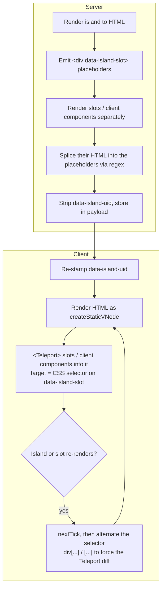
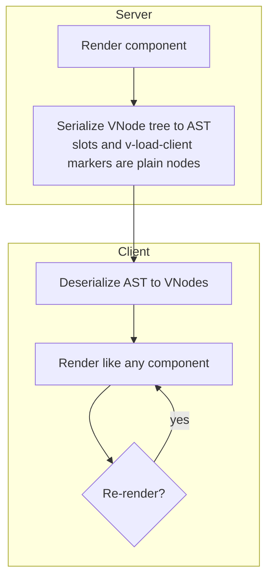

# vue-onigiri monorepo 🍙

<!-- automd:badges color=yellow -->

<!-- /automd -->

Vue Onigiri brings React Server Components-style rendering to Vue. Components render on the server into a transferable AST; the client deserializes that AST back into VNodes, and only components marked with `v-load-client` ship their JS to the browser.

## Motivation

This package has been created after multiple issues on maintaining [Nuxt Islands](https://nuxt.com/docs/4.x/api/components/nuxt-island) which uses HTML.

[Nuxt Islands](https://nuxt.com/docs/4.x/api/components/nuxt-island), when it comes to Slots and loading components within the island is quite complex to make it work.

Basically, you have to be aware of Vue's render mechanism. When the island, one of its slots or a client component within it is re-rendered, we have to trick re-teleport.

Every step leans on how Vue's renderer, `<Teleport>` and static VNodes happen to behave, and each Vue release is a chance for one of them to break.

vue-onigiri removes the problem instead of patching it: the server ships a **VNode AST**, not HTML. Slots and `v-load-client` components are ordinary nodes in that tree.

This lead to different perf issue and maintainability issues.

Vue onigiri aims to fix theses issues by moving Static HTML to AST. Every VNode that can be described is serialized into AST and deserialized back into VNode.