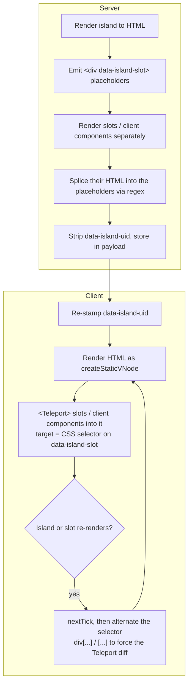
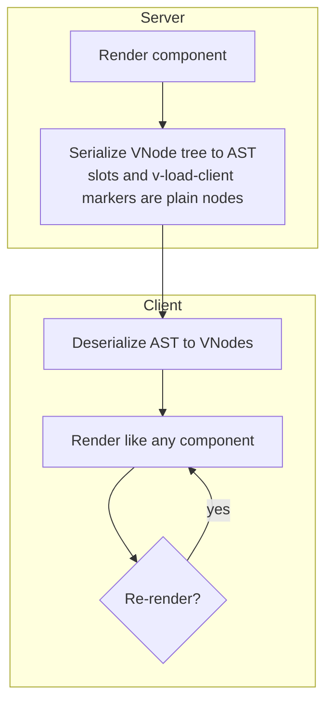

# vue-onigiri 🍙

<!-- automd:badges color=yellow -->

[](https://npmjs.com/package/vue-onigiri)
[](https://npm.chart.dev/vue-onigiri)

<!-- /automd -->

Vue Onigiri brings React Server Components-style rendering to Vue. Components render on the server into a transferable AST; the client deserializes that AST back into VNodes, and only components marked with `v-load-client` ship their JS to the browser.

## Motivation

This package has been created after multiple issues on maintaining [Nuxt Islands](https://nuxt.com/docs/4.x/api/components/nuxt-island) which uses HTML.

[Nuxt Islands](https://nuxt.com/docs/4.x/api/components/nuxt-island), when it comes to Slots and loading components within the island is quite complex to make it work.

Basically, you have to be aware of Vue's render mechanism. When the island, one of its slots or a client component within it is re-rendered, we have to trick re-teleport.



Every step leans on how Vue's renderer, `<Teleport>` and static VNodes happen to behave, and each Vue release is a chance for one of them to break.

vue-onigiri removes the problem instead of patching it: the server ships a **VNode AST**, not HTML. Slots and `v-load-client` components are ordinary nodes in that tree.



This lead to different perf issue and maintainability issues.

## Installation

```sh
npm install vue-onigiri
# or: pnpm add vue-onigiri / yarn add vue-onigiri / bun add vue-onigiri
```

## Quick Start

### 1. Configure Vite

```js
// vite.config.js
import { defineConfig } from "vite";
import vue from "@vitejs/plugin-vue";
import { onigiriCompilerPlugin, onigiriManifestPlugin } from "vue-onigiri";

export default defineConfig({
  plugins: [vue(), onigiriCompilerPlugin(), onigiriManifestPlugin()],
});
```

### 2. Mark client-loaded components

Add `v-load-client` to any component that should hydrate on the client. The component **must** be statically imported in the same SFC (or registered through `additionalImports` / the Nuxt module). Relative, aliased (`@/`, `~/`), extension-less, and package imports all resolve - the compiler goes through the bundler's own resolver:

```vue
<template>
  <div>
    <h1>Rendered on the server</h1>
    <Counter v-load-client />
  </div>
</template>

<script setup>
import Counter from "./Counter.vue";
</script>
```

The compiler reads the import and inlines `/components/Counter.vue` into the serialized payload. Components without `v-load-client` are rendered on the server and inlined - their source never reaches the browser.

### 3. Serialize on the server

```js
import { serializeApp } from "vue-onigiri/runtime/serialize";
import { createSSRApp } from "vue";
import App from "./App.vue";

const app = createSSRApp(App);
const data = await serializeApp(app, undefined, { url: req.url });
// send `data` to the client (inlined in HTML, JSON endpoint, etc.)
```

### 4. Render on the client

```js
import { renderOnigiri } from "vue-onigiri/runtime/deserialize";
import { createApp } from "vue";

const app = createApp({
  setup: () => () => renderOnigiri(data),
});
app.mount("#app");
```

Wrap the mount point in `<Suspense>` if your tree contains `v-load-client` components - each loader uses its own internal `<Suspense>`, but a top-level boundary keeps the initial render hydration-safe.

## Vite Plugins

### `onigiriCompilerPlugin(options?)`

Generates the per-SFC `__onigiriRender` function from each `<template>`. This is the only plugin doing real codegen work.

```ts
interface OnigiriCompilerOptions {
  /**
   * Emits a source map for the generated render function.
   *
   * @default true
   */
  sourceMap?: boolean;
  /**
   * Just like Vue
   */
  isCustomElement?: (tag: string) => boolean;
  /**
   * Registers components the SFC doesn't import statically, so `v-load-client` can resolve them (Nuxt auto-imports, globals). 
   * A getter is re-evaluated on every transform.
   */
  additionalImports?:
    | Record<string, AdditionalImportInput>
    | Map<string, AdditionalImportInput>
    | (() => Record<string, AdditionalImportInput> | Map<string, AdditionalImportInput>);
  /**
   * Bakes a public chunk URL into the AST in place of the root-relative source path of a `v-load-client` target.
   *
   * @remarks Returning `undefined` keeps the source path for runtime resolution.
   */
  resolveChunkUrl?: (sourcePath: string) => string | undefined;
  /**
   * Scans SFC templates for `v-load-client` targets at `buildStart`, so the manifest's `"auto"` includes are complete before any environment builds.
   *
   * @default true
   */
  scan?: boolean | OnigiriScanOptions;
}

type AdditionalImportInput = string | { path: string; export?: string };

interface OnigiriScanOptions {
  /**
   * Limits the scan to these directories, absolute or relative to the Vite root.
   *
   * @default ["."]
   */
  include?: string[];
  /** Skips these directory names during the scan, on top of the built-in defaults. */
  exclude?: string[];
}
```

### `onigiriManifestPlugin(options?)`

Emits the `virtual:onigiri/manifest` virtual module that the runtime loader imports. It exposes an `importFn(src, exportName?)` that resolves a root-relative `.vue` path via `import.meta.glob`.

```ts
/**
 * Glob selection for one manifest environment: explicit patterns, or
 * `"auto"` for the scanned `v-load-client` targets, alone or in an array.
 *
 * @remarks `false` disables the glob.
 */
type OnigiriManifestInclude = "auto" | string | string[] | false;

interface OnigiriManifestPluginOptions {
  /**
   * Selects which source files the server manifest can load.
   *
   * @default "auto"
   */
  serverInclude?: OnigiriManifestInclude;
  /**
   * Selects which source files the client manifest can load.
   *
   * @remarks `false` means a source-path descriptor reaching the browser needs a custom `importFn`.
   * @default false
   */
  clientInclude?: OnigiriManifestInclude;
  /**
   * Adds literal loader entries, consulted before the glob, for chunk references a glob cannot express, typically package components. Keys are AST chunk references, values are bundler-resolved specifiers.
   */
  extraEntries?: Record<string, string>;
  /**
   * Emits a manifest without `import.meta.glob` in every environment, for bundlers that can't preprocess it or compile `.vue` imports, such as Nitro's pure-Node rollup.
   *
   * @default false
   */
  stub?: boolean;
}
```

#### Package components (`extraEntries`)

A `v-load-client` target imported from a package (`some-ui-lib/Button.vue`) can't be covered by the manifest glob: bare specifiers aren't valid `import.meta.glob` patterns, and in a built app a runtime `import()` of a bare specifier has no bundler behind it. `extraEntries` fixes this by emitting a literal `"key": () => import("spec")` into the manifest, so each environment's bundler resolves the specifier and emits its chunk (browser chunk in the client build, SSR chunk in the server build):

```ts
onigiriManifestPlugin({
  extraEntries: {
    "some-ui-lib/Button.vue": "some-ui-lib/Button.vue",
  },
});
```

- **Only needed for package components.** Project files are covered by the glob; dev doesn't strictly need entries either (the dev server resolves bare specifiers on demand), but the option is applied in dev too so behavior matches the build.
- **Key**: the chunk reference as it appears in the AST - for package components the compiler bakes the source specifier (`some-ui-lib/Button.vue`), or the URL the host baked via `resolveChunkUrl`. Lookup tolerates a leading-slash difference (`some-ui-lib/Button.vue` also matches `/some-ui-lib/Button.vue`), so one canonical key is enough; any other prefixing (e.g. an assets-dir prefix) must be registered as its own key or stripped by the host before lookup.
- **Values go through bundler resolution**, so aliased specifiers work too.
- **Packages shipping raw `.vue` files must be `ssr.noExternal`** (e.g. `ssr: { noExternal: ["some-ui-lib"] }`): an externalized entry leaves a runtime `import()` of a `.vue` file that Node cannot load.
- Under `stub: true` the entries are dropped along with the glob, for the same reason stub exists: those bundlers can't compile `.vue` imports.
- With `"auto"` includes, scanned package targets that no entry covers are excluded from the glob and reported via a debug-level plugin log naming the specifier.

## Nuxt

Nuxt integrates onigiri directly: wire is handled inside Nuxt core, which feeds its component registry into the compiler's `additionalImports` so auto-imported components work with `v-load-client` without further setup. No separate module to install.

## API Reference

### `serializeApp(app, slots?, ssrContext?)`

Serialize an entire Vue app instance.

```js
import { serializeApp } from "vue-onigiri/runtime/serialize";

const data = await serializeApp(app, undefined, { url: "/page" });
```

### `serializeComponent(component, props?, slots?, ssrContext?)`

Serialize a single component without mounting an app.

```js
import { serializeComponent } from "vue-onigiri/runtime/serialize";

const data = await serializeComponent(MyComponent, { title: "Hello" });
```

### `renderOnigiri(data)`

Deserialize a payload back into a VNode tree.

```js
import { renderOnigiri } from "vue-onigiri/runtime/deserialize";

const vnode = renderOnigiri(data);
```

### Chunk loading (`importFn`)

Each `v-load-client` marker in the AST is resolved through an `importFn(src, exportName?)`. The loader picks it in this order:

1. **Per render** - `renderOnigiri(ast, { importFn })`. Forwarded as a prop to every `vue-onigiri:component-loader` the AST contains, so nested `v-load-client` targets inherit it.
2. **Per app** - `app.use(onigiriPlugin, { importFn })`. Injected via Vue's provide/inject; ideal for meta-frameworks that configure loading once.
3. **Manifest default** - the module `vue-onigiri/runtime/manifest-default`. On Vite, `onigiriManifestPlugin` redirects it to the generated manifest (`import.meta.glob` map + absolute-URL `import()`). Other bundlers can alias this specifier to their own module exporting `{ manifest, importFn }`.

Without any of the three, the loader throws with setup guidance - the runtime itself has no Vite-only imports and works under any bundler (or none).

```js
import { renderOnigiri } from "vue-onigiri/runtime/deserialize";

renderOnigiri(ast, {
  importFn: async (src, exportName = "default") => {
    const mod = await myCustomLoader(src);
    return mod[exportName] ?? mod.default ?? mod;
  },
});
```

```js
import { onigiriPlugin } from "vue-onigiri/runtime/plugin";

app.use(onigiriPlugin, {
  importFn: async (src, exportName = "default") => {
    const mod = await myCustomLoader(src);
    return mod[exportName] ?? mod.default ?? mod;
  },
});
```

## How It Works

1. **Compile time** - `onigiriCompilerPlugin` generates a per-SFC `__onigiriRender` function. For `<X v-load-client />`, the chunk path is resolved from the SFC's static imports (or `additionalImports`) and embedded as a literal string. Unresolvable targets fail compilation with an explicit error.
2. **Server render** - `serializeApp` walks the rendered tree. Server components inline as HTML/AST; client components emit a marker `[Component, props, chunkPath, exportName, slots]`.
3. **Client render** - `renderOnigiri` recreates the VNode tree. Each `Component` marker mounts a loader that wraps `defineAsyncComponent` in its own `<Suspense>`, so hydration matches the server's empty fallback before swapping in the real component.

```
Server: VNode tree → serialize → AST + client markers
Client: AST → deserialize → VNode tree (lazy chunks resolved via importFn)
```

## Limitations

- Proof of concept - API is unstable, not production-ready.
- `v-load-client` requires compile-time path resolution: the target component must be statically imported in the SFC (any resolvable form: relative, alias, package), or registered through `additionalImports` (Nuxt handles this automatically for auto-imported components).
- `<component :is="x" v-load-client />` with a runtime `is` value isn't supported - the compiler can't resolve the path at build time.
- Components used outside an onigiri-compiled SFC (e.g. via Vue's vnode fallback path) can't carry `v-load-client`.
- Scoped slots can't be passed _into_ `v-load-client` components (the slot scope only exists on the client at runtime and can't be embedded in the frozen AST).
- Payload size grows with tree size; deeply server-rendered pages produce larger responses than equivalent SSR HTML.

## Development

```sh
pnpm install
pnpm dev          # interactive playground
pnpm test         # vitest
pnpm build        # build the library
pnpm lint         # eslint
pnpm lint:fix
```

## License

MIT - see `LICENSE`.

## Credits

- [@antfu](https://github.com/antfu) for naming this package 💖
